# VAN MODE VISUAL PROCESS MAP

## 🔍 VAN (VISUAL ANALYSIS) MODE WORKFLOW

```mermaid
flowchart TD
    Start([USER TASK SPECIFICATION]) --> VanInit[VAN Mode Initialized]
    
    VanInit --> ReqAnalysis[📋 REQUIREMENTS ANALYSIS]
    ReqAnalysis --> ReqDecomp[Break down user request]
    ReqDecomp --> TechContext[Assess technical context]
    TechContext --> Constraints[Identify constraints & limitations]
    
    Constraints --> ComplexityAssess{🎯 COMPLEXITY ASSESSMENT}
    
    ComplexityAssess -->|Simple| Level1[LEVEL 1: Straightforward]
    ComplexityAssess -->|Moderate| Level2[LEVEL 2: Standard Development]
    ComplexityAssess -->|Complex| Level3[LEVEL 3: Advanced Engineering]
    ComplexityAssess -->|Expert| Level4[LEVEL 4: Research/Innovation]
    
    Level1 --> ArchDesign1[🏗️ ARCHITECTURE DESIGN]
    Level2 --> ArchDesign2[🏗️ ARCHITECTURE DESIGN]
    Level3 --> ArchDesign3[🏗️ ARCHITECTURE DESIGN]  
    Level4 --> ArchDesign4[🏗️ ARCHITECTURE DESIGN]
    
    ArchDesign1 --> ResourceEval[⚖️ RESOURCE EVALUATION]
    ArchDesign2 --> ResourceEval
    ArchDesign3 --> ResourceEval
    ArchDesign4 --> ResourceEval
    
    ResourceEval --> AvailableAssets[Check available project assets]
    AvailableAssets --> TechStack[Evaluate technology stack]
    TechStack --> Dependencies[Assess dependencies & integrations]
    
    Dependencies --> ImplPlan[📝 IMPLEMENTATION PLANNING]
    ImplPlan --> TaskBreakdown[Create detailed task breakdown]
    TaskBreakdown --> Timeline[Estimate development timeline]
    Timeline --> Approach[Define implementation approach]
    
    Approach --> VanOutput[📊 VAN ANALYSIS OUTPUT]
    VanOutput --> Requirements[✅ Requirements Document]
    VanOutput --> Architecture[✅ Architecture Plan]
    VanOutput --> Implementation[✅ Implementation Strategy]
    VanOutput --> Recommendations[✅ Technical Recommendations]
    
    Requirements --> ModeTransition{🔄 MODE TRANSITION}
    Architecture --> ModeTransition
    Implementation --> ModeTransition
    Recommendations --> ModeTransition
    
    ModeTransition -->|Level 1| DirectImpl[→ IMPLEMENT MODE]
    ModeTransition -->|Level 2-4| PlanMode[→ PLAN MODE]  
    ModeTransition -->|Need Creativity| CreativeMode[→ CREATIVE MODE]
    
    DirectImpl --> UpdateMB1[Update Memory Bank]
    PlanMode --> UpdateMB2[Update Memory Bank]
    CreativeMode --> UpdateMB3[Update Memory Bank]
    
    UpdateMB1 --> Complete1[VAN Analysis Complete]
    UpdateMB2 --> Complete2[VAN Analysis Complete]
    UpdateMB3 --> Complete3[VAN Analysis Complete]
    
    %% Memory Bank Integration
    MemoryBank[MEMORY BANK SYSTEM] -.-> Context[Project Context]
    MemoryBank -.-> History[Implementation History]
    MemoryBank -.-> Assets[Available Assets]
    MemoryBank -.-> Lessons[Lessons Learned]
    
    Context -.-> ReqAnalysis
    History -.-> ResourceEval
    Assets -.-> ArchDesign1 & ArchDesign2 & ArchDesign3 & ArchDesign4
    Lessons -.-> ImplPlan
    
    %% Styling
    style Start fill:#f8d486,stroke:#e8b84d,color:black
    style VanInit fill:#ccf,stroke:#333,color:black
    style ReqAnalysis fill:#e6f3ff,stroke:#4d94ff,color:black
    style ComplexityAssess fill:#fff0e6,stroke:#ff8533,color:black
    style Level1 fill:#e6ffe6,stroke:#33cc33,color:black
    style Level2 fill:#fff0cc,stroke:#ffb366,color:black
    style Level3 fill:#ffe6cc,stroke:#ff9933,color:black
    style Level4 fill:#ffcccc,stroke:#ff6666,color:black
    style ArchDesign1 fill:#f0e6ff,stroke:#9966ff,color:black
    style ArchDesign2 fill:#f0e6ff,stroke:#9966ff,color:black
    style ArchDesign3 fill:#f0e6ff,stroke:#9966ff,color:black
    style ArchDesign4 fill:#f0e6ff,stroke:#9966ff,color:black
    style ResourceEval fill:#e6fff0,stroke:#4dff4d,color:black
    style ImplPlan fill:#ccf0ff,stroke:#3399ff,color:black
    style VanOutput fill:#ffffe6,stroke:#cccc00,color:black
    style ModeTransition fill:#f0f0f0,stroke:#808080,color:black
    style DirectImpl fill:#ccffcc,stroke:#66cc66,color:black
    style PlanMode fill:#ffccff,stroke:#cc66cc,color:black
    style CreativeMode fill:#ffcccc,stroke:#cc6666,color:black
    style MemoryBank fill:#f9d77e,stroke:#d9b95c,stroke-width:2px,color:black
```

## 🎯 VAN ANALYSIS OBJECTIVES

### Primary Goals:
1. **Requirements Understanding**: Deep analysis of user specifications
2. **Complexity Assessment**: Accurate difficulty classification (Level 1-4)
3. **Architecture Design**: Technical approach and solution structure
4. **Resource Evaluation**: Available assets and implementation constraints
5. **Implementation Planning**: Detailed execution strategy

### Success Criteria:
- [ ] User requirements fully understood and documented
- [ ] Complexity level accurately assessed and justified
- [ ] Technical architecture clearly defined
- [ ] Implementation approach detailed and feasible
- [ ] Resource requirements identified
- [ ] Next mode transition clearly determined

## 📋 VAN PROCESS CHECKLIST

### Phase 1: Requirements Analysis
- [ ] **User Request Decomposition**: Break down request into components
- [ ] **Functional Requirements**: What the system should do
- [ ] **Non-functional Requirements**: Performance, security, scalability
- [ ] **Constraints Identification**: Technical, business, resource limitations
- [ ] **Success Metrics**: How to measure completion

### Phase 2: Complexity Assessment
- [ ] **Technical Complexity**: Algorithm, architecture, integration challenges
- [ ] **Implementation Effort**: Development time and resource requirements
- [ ] **Risk Assessment**: Technical risks and mitigation strategies
- [ ] **Dependency Analysis**: External systems, libraries, services
- [ ] **Level Classification**: Assign Level 1-4 with justification

### Phase 3: Architecture Design
- [ ] **System Architecture**: High-level system structure
- [ ] **Component Design**: Individual component specifications
- [ ] **Integration Points**: How components interact
- [ ] **Data Flow**: Information movement through system
- [ ] **Technology Stack**: Specific technologies and frameworks

### Phase 4: Resource Evaluation
- [ ] **Available Assets**: Existing code, infrastructure, documentation
- [ ] **Required Resources**: New technologies, external services
- [ ] **Skill Requirements**: Technical expertise needed
- [ ] **Time Estimation**: Development timeline and milestones
- [ ] **Cost Analysis**: Resource costs and trade-offs

### Phase 5: Implementation Planning
- [ ] **Task Breakdown**: Detailed development tasks
- [ ] **Development Approach**: Methodology and workflow
- [ ] **Testing Strategy**: Quality assurance approach
- [ ] **Deployment Plan**: Release and deployment strategy
- [ ] **Documentation Requirements**: Technical and user documentation

## 🔄 MODE TRANSITION RULES

### Level 1 Tasks → IMPLEMENT MODE
- Direct implementation for straightforward tasks
- Clear requirements with standard solutions
- Minimal architectural complexity

### Level 2-4 Tasks → PLAN MODE  
- Complex requirements needing detailed planning
- Multiple components or integration challenges
- Significant architectural decisions required

### Creative Tasks → CREATIVE MODE
- Novel solutions or innovative approaches needed
- Unclear requirements requiring exploration
- Research and experimentation components

## 🧠 MEMORY BANK INTEGRATION

### Context Preservation:
- **Project History**: Previous implementations and decisions
- **Technical Assets**: Available code, infrastructure, documentation
- **Lessons Learned**: Previous challenges and solutions
- **User Preferences**: Established patterns and requirements

### Continuous Updates:
- **Analysis Results**: Document findings and decisions
- **Architecture Decisions**: Record design choices and rationale
- **Resource Assessments**: Update available assets inventory
- **Implementation Plans**: Maintain detailed execution strategies

---
**VAN MODE READY** - Systematic visual analysis for development tasks
